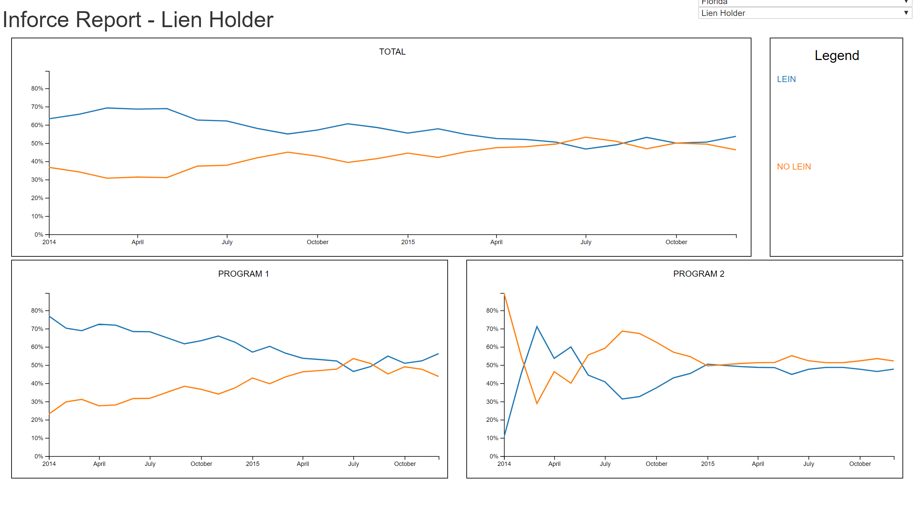
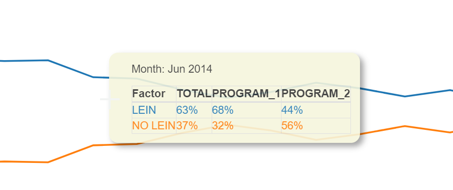
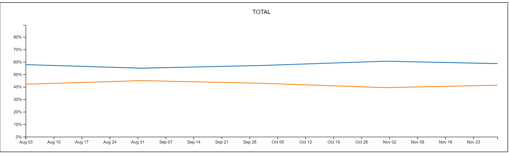

# Multiple Line Graphs that interact with each other by Time Period

[Link](https://htmlpreview.github.io/?https://github.com/jjburke3/multiple_line_graphs/blob/master/inforce.html)

This interactive was created to show how percentage of inforce insurance policies by factor changed over time.  There are drop-downs in the righthand corner to change which information is being displayed

If you hover over a graph, it will display information on all programs for that time period, not just for the graph that you hover on

There is also a zoom function, which is activated by clicking and dragging on a chart, and removed with a double-click on the chart

## Built With

* [d3.js](https://d3js.org/) - Javascript Library for Manipulating Data
* [Bootstrap](https://getbootstrap.com/) - Frontend Webframe Work
* [jQuery](https://jquery.com/) - Javascript Library for simiplfying javascript commands
* [DataTables](https://datatables.net/) - jQuery plugging for table formatting

